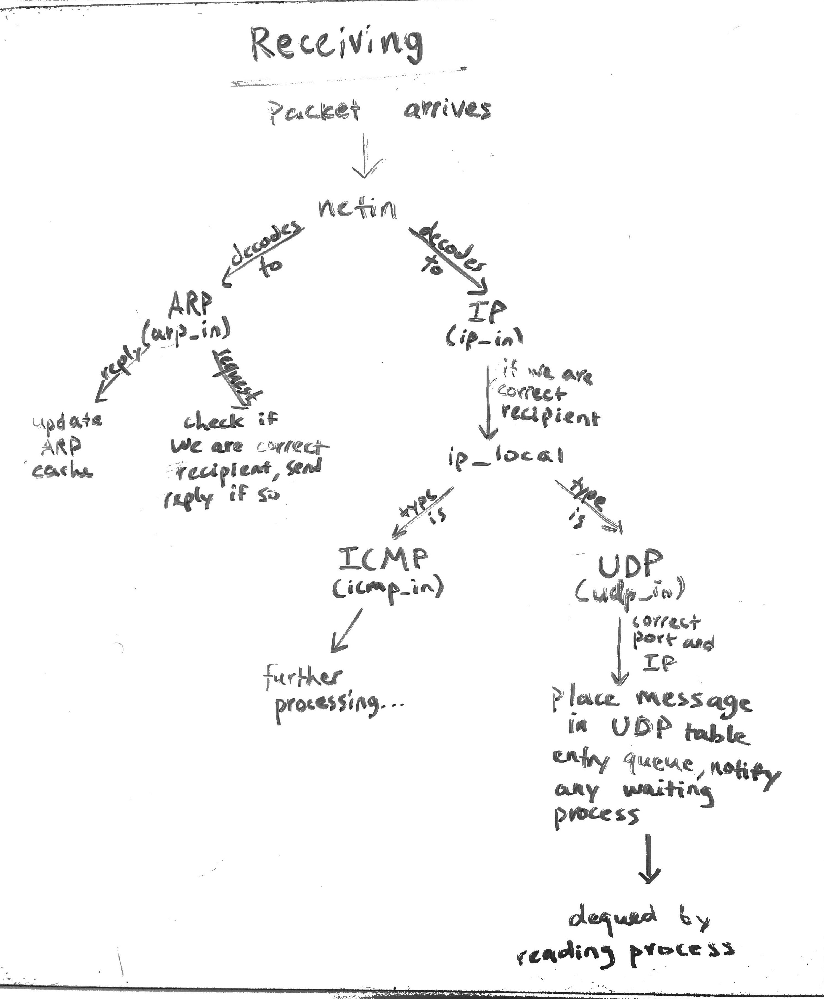
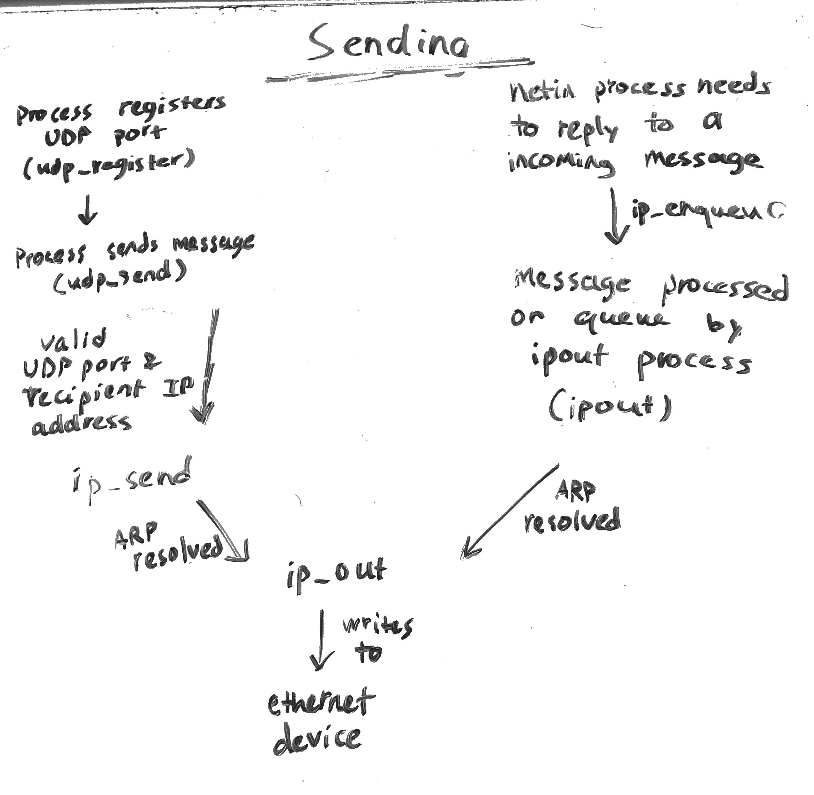
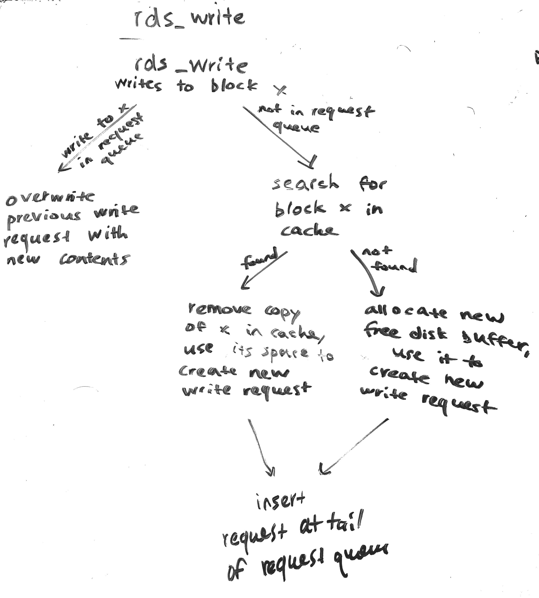
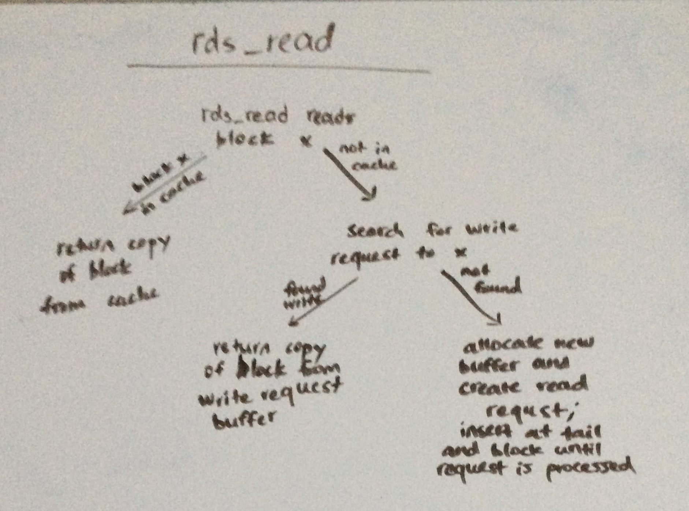

# Remote File Systems Research Useful Terminology/Background Info
## Accessing the Internet in Xinu
- General Design:
  - There is a *netin* process that handles the reception of packets, and a *ipout* process that handles outgoing messages. The purpose of *ipout* is because we do not want *netin* to block while waiting for a reply.
- ARP: address resolution protocol
  - Before 2 computers can communicate using IP, they must know each other's Ethernet/MAC addresses. This is an address unique to each computer in the local network.
  - We do this using ARP. The sending computer sends a broadcast with the destination IP, and the destination IP responds with its Ethernet/MAC address. The sending computer stores this info in a cache in order to have that info for next transmission.
  - Whenever we send a packet, we call *arp_resolve*, which takes in the destination IP address, and converts it to a MAC address to send the data.
- *netin*
  - The *netin* process repeatedly allocates a buffer, waits for the next packet, and then uses information in each packet to decide which protocol (ARP or IP) to use to decode the packet. If it is ARP, then the packet is passed to *arp_in()*, and if it is IP, it is passed to *ip_in()*

- Dynamic Host Configuration Protocol
  - When a computer boots, it needs to obtain its IP address. It does this with DHCP, by broadcasting a DHCP discover message, and the DHCP server on the local network replies with a DHCP offer that provides an IP address, a 32-bit subnet mask for the local network, and the IP of the default router.
  - For sending these messages, the computer will utilize the existing methods for sending UDP datagrams

## Remote Disk Drivers
- The basic function of a disk driver is to be able to read disk blocks into main memory, and write (copy) data from memory onto a specified disk block
- A remote disk driver is a set of functions that interact with a remote disk server rather than a local disk
  - The main difference between the two is that a remote disk driver, rather than using DMA and interrupts, uses a high-priority communication process that sends requests over a network to and receives responses from the remote disk server.
- The importance of caching
  - Disk access is very slow compared to CPU operations, so if every time we want to read/write to disk we do a disk operation, the CPU will be slowed down trememdously.
  - To avoid this, we utilize caching, wherein whenever we make a disk access, we copy the accessed block into a main memory cache, so that subsequent read/write operations occur on the copy, which is faster than performing disk I/O
- The upper half of the kernel interfaces with the remote disk driver communication process through a shared data structure that contains the cache of disk blocks and a list of pending requests.
  - The reason we have a list of requests is that writing, unlike reading, is asynchronous. This means that when we read, the process blocks until the read-in block has been fetched (either from the cache or from the disk itself). However, when writing, we instead place the desired change on a request queue, and the communication process will continually handle the requests on the queue. The process that called the write operation can continue execution.
- Although we delay write operations, we still need to make it appear that write operations are synchronous. In other words, if we make a read operation, we must return the data in its most recently written-to form, even if that write operation was delayed.
  - To accomplish this last-write concept, we use a FIFO queue to process both read and write requests, so that when a read occurs, we know that all preceding write operations to that block have already been processed.
- We have a control block that contains all the data structures needed for remote disk communication
  - It has the FIFO queue of requests, a FIFO queue of cached blocks, and a FIFO queue of free disk buffers that we can use to make requests or cached blocks
- 
- 
  - in addition, rds_read, after inserting into the buffer and waiting, checks if the reference count of the returned block becomes 0. If so, and there is an additional copy of the read block in the cache, the copy will be removed from the cache since it is not needed anymore.
- We also have rds_control, which can flush the request queue (SYNC) to ensure all write operations complete before continuing execution, or it can also delete the remote disk contents.
- We also have a daemon that constantly takes items off the request queue and sends them to the remote disk server.
  - Everytime it receives a response, it caches this block on the local machine for quick access for subsequent operations.
  - It also handles deallocating unused buffers by signaling the avail semaphore that is used to check if there is an avaiable buffer to allocate in rds_bufalloc.
- Overall, this design works because we assume there is only one client at any given time to the remote disk server.
  - If there were multiple clients interacting with the server simultaneously, then this design would fail in terms of sychronization.
  - This is because, with only one client, all the information needed for correct caching and last-write mechanics can be kept track of by the client itself. In this case, the free list, the cache, and the request queue contain all the info necessary to maintain correct coordination between local processes. 
  - However, if we extend the design to multiple clients, this is not enough anymore. Consider if another client writes right before our client make a read operation. Since we only use local info, the read operation will not wait for the write operation to finish, and will therefore not fetch the correct data from the server. These are the types of situations we have to account for with multi-client access.
  - To address these issues, much of the synchronization will need to be addressed on the server-side. In other words, it will be the server's responsibility to coordinate read and write requests so that they occur in the correct order.
  - However, to accomplish this, we sacrifice efficiency and speed for correct synchronization. This is because such a design will involve much more interaction with the server, since caching on local clients is not really an option anymore. Since server communication takes much longer than CPU operations, performance decreases. 

## File Systems in Xinu
- Basic functions of a file system
  - Manages files, which are data objects that persist longer than processes
  - Provides operations to create, delete, open, read, write, close, and seek
  - In Xinu, each file is considered a sequence of bytes (untyped file system)
    - In a typed file system, there are a variety of different file types the OS understands
    - Untyped simplifies the code a lot since the OS does not have to worry about what the contents of the file is
  - The file system needs to be dyanmic, meaning that we can allow for arbitrary file creation and growth. Therefore, space for files cannot be pre-allocated on disk, it needs to be allocated as files are created and grow.
  - To avoid complexities involved with concurrent file access, Xinu limits files to one active open, so at most one process can interact with a given file at any time.
- Disk setup
  - Xinu allocates disk blocks dynamically
  - The disk is split into 3 sectors: directory, index, and data
  - The directory maps filenames to index blocks for each file, and also has a pointer to a list of unused index blocks and a pointer to a list of free data blocks
  - The index blocks (i-blocks) are used to create the index for each file, which is a singly-linked list of index blocks. Initially, i-blocks are on a free list and are allocated as needed, and returned when a file is truncated or deleted
  - Each i-block points to 16 data blocks (d-blocks)
- Interaction with processes
  - For sake of simplicity, we will use existing device interaction mechanisms for files
  - This means that we will treat files as "pseudo-devices" so that we can communicate with them through the same *read* and *write* calls as before
  - This is different from Unix, which treats everything, including devices, as files. Xinu treates everything, including files, as devices.
- Both reading and writing rely on function *lfsetup*
  - The current file position is stored in a variable for the file descriptor, and whenever we read or write, we have to make sure that the index and data blocks corresponding to that position are loaded into memory
  - When they are not loaded in, we call *lfsetup* to load the appropriate blocks in so we can continue with the read or write

## Remote File Systems
- A remote file system is primarily the same as a local file system, but instead of doing hardware operations in the form of disk I/O to interact with files, we instead send network requests to a server and receive the response.
- Requirements
  - Device driver for a network device
  - Protocol software (UDP/IP)
  - Remote file access software to form and send requests
  - A remote file server to respond to requests
- Challenges/considerations
  - Have to decide what services the server can provide
  - What happens when 2 clients each request to open the same file--should they be shared or each have their own copy?
  - Should we use caching?
  - An additional challenge is that the server may not run Xinu, so not all the file interaction methods will be mapped one-to-one with how Xinu does things
- The Remote File System software is split into two levels
  - The lower half deals with communication with the remote server (sending and receiving messages)
  - The upper half handles message semantics (forming messages, passing them to lower half, and interpreting responses received from lower half)
  - This makes it so the lower half does not have to understand/interpret the contents of messages it sends/receives
- Due to potential differences in endianess between the client and server, we always convert integers from local host to network byte order when sending (*htons*), and from network byte order to local host order when receiving (*ntohs*)
- Functions
  - *rfscomm* deals with a generic sending of messages. Any of the following functions that send messages to the server do so using *rfscomm*
  - *rfsopen* registers a new pseudo-device for the specified remote file in the device table. It sends an open request message to the server.
  - *rfsclose* de-registers the specified pseudo-device, but does not notify the server that the file is closed.
  - *rflread* reads from the remote file by sending a message to the server and placing response in passed-in buffer.
  - *rflwrite* writes to the remote file by sending a message to the server
  - *rflseek*: to avoid having the send a message every time we seek, we instead send the file position in every read/write request. Therefore, all *rflseek* does is update the file position locally.
  - *rfscontrol* allows us to perform additional operations like deleting files, truncating files, making/removing directories, or getting the size of a file
- Performance
  - There is a tradeoff between efficiency and sharing capabilities
  - If no sharing is allowed, we can make the system very efficient by utilizing local caching
  - If sharing is allowed, then in order to preserve last-write semantics, we need to be send every file operation to the remote server so that the operations occur in the correct order
  - Even with this in mind, there are subtle difficulties, such as if two computers have access to a file, and one computer adds to the file, making it longer. Then, if computer 1 wants to seek to the end of the file, it has to contact the server to find the new length of the file. 