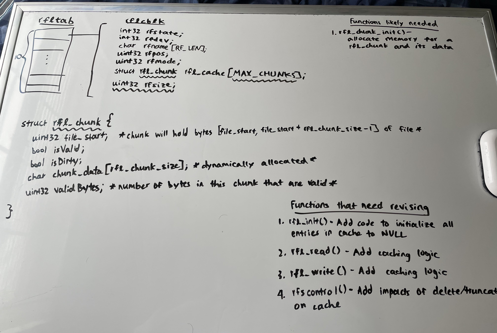

# Research Log
## Remote File Systems Research
## Anderson David under Prof. Douglas Comer
------
## 1/18/21
### Notes
- Downloaded/extracted version of Xinu and version of new server
- Wrote code for user to input remote server's IP address
- Started testing connection to remote file system

### Issues/Improvements 1/18/2021
1.  Problem with initializing network setup
   - Solution: had to uncomment out call to *net_init* in system/initialize.c
2.  Problem with receiving TIMEOUT on open request
   - Solution: [See 1/20 Issue #1]

## 1/20/21
### Notes
- Met with Pr. Comer to discuss some questions
- Went over problem encountered on 1/8

### Issues/Improvements 1/20/2021
1.  [1/18 Issue #2](#issuesimprovements-1182021)
   - Solution: for some reason, the Xinu client was not retrieving its local IP address (when monitoring packets using *pdumph()*, the src was 0.0.0.0 rather than true IP). A call in *main* to *getlocalip()* fixed this. 
   - [See 1/25 Issue #1] for more permanent fix.

## 1/21/21
### Notes
- Tested reading/writing messages with new-rfserver
  - able to write a message, seek back to beginning, then read the message written to the file
  - data persists across client lifetime--if I restart the client I can still access info written by a previous client

### Issues/Improvements 1/21/2021
1.  Potential problem with reading more bytes than file length
   - Receives strange characters instead of just EOF; probably need to modify on the server side.
   - [See 1/25 Issue #2] for solution.
2.  Potential problem with opening then immediately reading a file on server start
   - Server seems to freeze, and all client requests from that point on TIMEOUT (even after restarting client and trying to open or write)
   - [See 1/27 Issue #1] for solution

## 1/25/21
### Notes
- Solved the issues stated below, and added a potential improvement, which I implemented but need to check with Prof. Comer if this is a useful design strategy.
  
### Issues/Improvements 1/25/2021
1.  [1/20 Issue #1](#issuesimprovements-1202021)
   - Problem with unretrieved local IP permanently fixed by adding a call to getlocalip() in net/net.c:70 in function net_init()
2.  [1/21 Issue #1](#issuesimprovements-1212021)
   - Reason for strange characters was that the buffer used in main() was not cleared after retrieving from call to getmem(). A call to memset() on the buffer to intialize it to all zeroes fixes the strange characters. Server sends correct response length.
3.  Potential improvement to rfsread()
   - A potential improvement to rfsread() would be to only copy min(count, resp.rf_len) bytes into the buffer. If resp.rf_len > sizeof(buffer), then rfsread() would overwrite potentially sensitive data.

### Questions
- Whenever the Xinu backend gets loaded, does it retrieve a new IP address from DHCP every time? If so, how does it reliably get the same address every time? 
- So sending udp messages, such as those required for the rfs communications, don't utilize the ipout process? What is that process used for then?

## 1/27/21
### Notes
- Reading through server code to fix 1/21 Issue #2
  - found that when I define a preprocessor constant DEBUG in rfserver.h, open followed by read works fine (regardless of what DEBUG is set to), but when it is not defined, server freezes
  - Based on debug messages seen on correct behavior, the server appears to send a response to the open request and then freezes after recv()ing the read request when it errors
  - Appears that, with DEBUG undefined, the open request does not actually place the file pointer into the open file table, as on the subsequent read request, we do not find the file in the open file table.
  - Actually, it seems that the opened file is placed in the open file table after the server handles the read request...
  - This is not due to messages arriving too quickly, as I tried sleeping for 5s between sending the open and read requests

### Issues/Improvements 1/27/2021
1.  [1/21 Issue #2](#issuesimprovements-1212021)
   - Determined that the problem is that, when the server receives an open request, it either does not actually open the file, or that the opened file is not placed in the open file table.
   - Turned out that the call to rsofile() for files that already exist in the server was grouped into the ifdef for DEBUG, so that the call to open a file that had been created before would not go through unless DEBUG was defined. Once I moved that out, everything worked fine.
2.  [1/25 Issue #3](#issuesimprovements-1252021)
   - Upon further inspection of how the server handles read requests, it actually just calls the Linux syscall read, and the number of bytes read by Linux is what is placed in the response's length. So, this mitigates the risk of buffer overflow, although it could still be useful on the Xinu side if we request to read more bytes than our buffer can handle, although this might be a responsibility that should be delegated to the programmer not the RFS.

### Questions
- In the server code, why do we reset the server's local sequence to 0 if the current packet's sequence is 1?
  - In general, what is the sequence number used for?
- How do you send a mkdir request in Xinu?
- Why, when reading a directory, does the server just return the next entry in the directory? Why doesn't it read all of the files in the directory?
  - Answer: this is how it's implemented in Linux. We use the readdir() function to get the next entry pointed to by our directory pointer. We can do the same thing in Xinu by just calling read() on our directory to get the next entry at each stage.

## 2/1/2021
### Notes
- Sent update email to Professor Comer
- Continued testing rfs functionality
  - In particular, testing retreieving file size and truncating a file
- Began investigation caching
  - The max size of data that can be returned from a single request is 1024 bytes, so that may be an ideal size of caching buffers

### Issues/Improvements 2/1/2021
1.  Potential improvement to rfscontrol()
   - As of now, when using rfscontrol to retrieve the size of a file, it does not seem to allow for the passing of a file name, and will only return the size of the first opened file (even if that file has been closed).
   - See [2/4 Issue #1](#issuesimprovements-242021) for solution

### Questions
- From the client perspective, can there be only one open file at a time? And if not and we can have multiple, how does the client retrieve the size (or any control function) of specific files, because file size requests are sent to the RFILESYS device itself, not specific open file objects?

## 2/3/2021
### Notes
- Continued investigating how rfscontrol() works with file size requests, specifically how it decides which file to request size of
  - Tried to call rfscontrol on the remote file directly rather than the control block, but this just led to an error
  - Interestingly enough, when you close all the files and then open the one you want size of, then when you request file size it is correct. So, I think since the RFILESYS only has 1 control block, its minor number is 0, so in rfscontrol we mistakenly try to access the 0th control block of the remote file control block array, which will always be the remote file occupying the first entry in this array.
- Found that when closing a remote file, we don't actually inform the server of the file being closed, we just free the device table entry for the remote file

### Issues/Improvements 2/3/2021
1.  [2/1 Issue #1](#issuesimprovements-212021)
   - After some more investigating, confirmed that there is no way to pass a specific file into rfscontrol() when requesting file size.
   - I believe the problem is due to the fact that rfscontrol() gets called on the RFILESYS pseudo-device rather than a specific remote file pseudo-device.
   - In rfscontrol(), we obtain a pointer to the control block of the remote file we want to get information of, but this is incorrectly computed because we use the RFILESYS's device number instead of the remote file's pseudodevice
   - See [2/4 Issue #1](#issuesimprovements-242021) for solution
2.  [1/27 Issue #2](#issuesimprovements-1272021)
   - After talking with Prof. Comer about this, realized that since the request size gets it number of bytes from size of user's buffer, there should be no way that the buffer overflows, unless the server returns more bytes than the requested data, which I may implement for caching purposes. Otherwise, this should not be an issue presently.

## 2/4/2021
### Notes
- Working on fixing problem with rfscontrol when obtaining file size
  - Right now, I see two possible ways to fix the problem: 
    - First, we could just make it so that when you call control() on RFILESYS with RFS_CTL_SIZE, rfscontrol() will read the "arg1" argument passed in as a file name to retrieve size of.
    - Second, it seems that the intended usage (and what would make more sense possibly) is that you can call control() on the remote file device directly to obtain the size of that file. So, I could change the config so that calling control on a rfl pseudodevice will redirect to rfscontrol(), and then in rfscontrol(), I can see if the calling device is a remote file pseudodevice I'll only allow RFS_CTL_SIZE to go through, otherwise I'll call ioerror() as the current implementation does.
  - The main pro with the first potential fix is that I can get the file size of any file I want, even ones that aren't open currently.
  - The pro of the second potential fix is that it seems more intuitive from a programmer perspective, in that if you have an open file descriptor you should be able to get the file size by calling control() on that object itself.
  - Maybe it would be worth it to implement both versions, and just add some initial logic to rfscontrol() that can make it function differently if called from RFILESYS or on a specific remote file.
  - Found that the function rfsndmsg() actually implements the first approach already, by substituting a specified file name in place. However, this function is used for messages whose reponse is only success or error, such as making a directory or truncating/deleting a file. Therefore, probably cannot use it for file size request without alteration.

### Issues/Improvements 2/4/2021
1.  [2/3/2021 Issue #1](#issuesimprovements-232021)
   - Implemented fix #1 where, in the case of a file size request, substituted the passed in file name as the message's file name. This seems to fix the problems.
   - Also implemented fix #2, so you can call for a file size request on a remote file object directly by calling control() on the descriptor. However, if you try to call any control func other than RFS_CTL_SIZE, you get an error.

### Questions
- What's the best way to handle the above issue?

## 2/8/2021
### Notes
- Changed working directory to a fresh copy of xinu from xinu website instead of version used in CS354.
  - Found that the problems encountered early on with getting local ip were not present when using a fresh version.
  - My version of rfscontrol() seems to work with this version as well, as I can still communicate with the rfserver and get file size by either specifying file to RFILESYS device or calling it on rfl device directly.
- In regard to the potential buffer overflow issue presented in [2/3 Issue #2](#issuesimprovements-232021) and prior, received guidance from Professor Comer that, although this would not be a problem if the client-server interactions go through as expected, it could be a vulnerability if attackers try to compromise a Xinu system by sending spoofed responses that would overflow the buffer. So, I guess it is safer to keep this improvement. 
- Instead of writing all testing code in main(), I added a file called rfstesting.c, and in it have various functions to specify each test that I conduct. That should clean up the code in main() and make it easier to keep track of what I am testing at any given time. 

### Issues/Improvements 2/8/2021
1.  Potential Improvement for Size Requests
   - Noticed that when we request the size of a file that does not exist, server responds with 0. Would it be better to respond with SYSERR?

## 2/10/2021
### Notes
- Testing creating/removing directories
  - Creating a directory works fine
  - For removing directories, I noticed that if the directory is empty, I can remove it if it is empty, but if it is not empty, I cannot. I looked up how it is implemented in Linux, and directories must be empty for rmdir() syscall to work there, so it is probably good to keep it like this. Maybe add functionality to recursively delete directories down the line.

### Issues/Improvements 2/10/2021
1.  [2/4 Issue #1](#issuesimprovements-242021)
   - For fix #2 where we can call control() on a rfl device, there is a problem where if we try to call it on a closed device pointer, that the size returned is still equal to that of the last-open device pointer in that slot.
   - Fixed issue by returning SYSERR if the device is an rfl device and its state is RF_FREE
2.  Potential Improvement for Creating Directories
   - In the current implementation, if we try to create a directory that already exists, then the server just returns SYSERR. Would it be useful to respond with a more specific error message to let the user know that the request failed because the directory already exists to differentiate from it failing for some other reason?
3.  Improvement to Reading Directories
   - Because we do not close files on the server side when calling close in Xinu, the directory pointer on the rfserver is never closed. So, if we open a directory on Xinu and read through it, we will as expected get the contents of this directory. However, if we close then re-open this directory on the Xinu side and try to read through again, we will get no items back. This is because the directory pointer was never closed on the server side, so it still points to a NULL entry since from its perspective the directory has been read-through, while from the Xinu side we are using a new device pointer entirely.
     - See [[2/12 Issue #2](#issuesimprovements-2122021)] for solution

## 2/12/2021
### Notes
- Working on fixing [2/10 Issue #3](#issuesimprovements-2102021)
  - One potential fix is that whenever we send an open request to the server and the server decides that directory is already open, we just close and re-open that directory.
  - Alternative fix: use seekdir() to seek to the beginning of the directory every time it is opened

### Issues/Improvements 2/12/2021
1.  Implication of [2/10 Issue #3](#issuesimprovements-2102021)
   - It appears that this problem applies to regular files as well--if we open, read, close, then open again from the Xinu side, won't the server have the file pointer position set to however many bytes were read? We should probably reset the file position on every open, file or directory.
     - Actually, for rsread, we specify the offset to read from on every read request, so even if the pointer was last set somewhere else, whenever we open the file on the Xinu side, from its perspective the position is at 0 and it will send this position to the server on every read.
   - This also begs the question of what if we have two file pointers to the same file, as in this implementation they would basically be sharing a common file pointer...
     - Well, technically this works because from the Xinu side every file pointer will have its own position, and we can just use the single file pointer on the server side to jump back and forth to wherever these pointers may be
-  [2/10 Issue #3](#issuesimprovements-2102021)
  - Fixed the issue by adding some logic that, when the file is already open on the server and is a directory, that we will seek to the beginning of the directory using seekdir().
  - Potentially, could implement a similar logic to normal files where we specify a position to read from every time... actually this is already implemented

## 2/15/2021
### Notes
- Going to start formulating how to implement local caching
- Ideas
  - Every read request will request a pre-set number of bytes from the server. Let's call this *rfl_chunk_size*
  - Xinu will dynamically allocate memory to store *rfl_chunk_size* bytes returned from a read request, as well as indicating what file they came from and what bytes in the file they correspond to (ex: bytes 0 through *rfs_chunk_size*, bytes 24 through *rfl_chunk_size* + 24, etc.). Also will keep track of validity of chunks.
  - These chunks will be stored in **some data structure** called *rfl_chunks*
  - Reading
    - Whenever we make a read request, we consult *rfl_chunks* to see if the bytes requested are already in the cache, and if they are valid. If so, just read from *rfl_chunks*, and if not make a request to server.
  - Writing
    - Upon some inspection, writing is implemented like so: if we write past file length, we will start appending. Otherwise, when we write to bytes that already have information, we will overwrite existing data (this makes caching implementation a little easier)
    - From this, we have a few options
      - Option 1) writes invalidate the cache: whenever we overwrite file data, that section of the cache becomes invalidated.
      - Option 2) writes get applied to the cache: whenever we overwrite file data, we update that chunk of the cache. We can introduce a dirty bit to this that indicates blocks whose data have been changed. Then, when we decide to propagate changes to server, we can send write requests for dirty blocks. This can occur as writes occur, or when we close the file.
  - Deletion/Truncation
    - Just set all chunks as invalid
    - Alternatively (or additionally), de-allocate these chunks
  - Closing the file
    - Same as deletion/truncation
  - Size requests
    - keep track of file size in cache
  - Directories
    - TBD...
- Things to consider
  - What is the best way to store the cached chunks?
    - The most straightforward way is probably with an array, and if we order the chunks by their corresponding file location, then we can access a chunk in constant time.
    - This gets more complicated when we have to start considering eviction though
    - Alternatively, we could use a tree-like structure based on starting file location, but this could require some overhead, and again evicting would be troublesome as we would have to delete from the tree
  - Constants
    - *MAX_CHUNKS*: the maximum number of chunks a remote file can have in its cache --> TBD...
    - *RFL_CHUNK_SIZE*: the number of bytes a cache chunk stores --> Right now, the RFS limits data length to 1024 (RF_DATALEN) bytes, which seems reasonable
  - Dealing with partially populated chunks
    - Inevitably, there will be some chunks where only part of the data is populated (Ex: If chunk size is 16, a file of size 24 will have one full chunk and one half-filled chunk)
    - Could set the un-used portions of the chunk to null chars, and could add a size field to ensure returned bytes are in the boundaries of this size
    - Alternatively, each chunk could keep track of the number of bytes in its data that are valid bytes (the sum of these across all chunks should equal the size of the file)

### Issues/Improvements 2/15/2021
1.  Potential Improvement for Deleting Files
   - When making a delete request, on the server side, we close the file if it is open, and then call unlink() to delete the file. Would it be better to do the same on the Xinu side, because right now if we open a file then delete it, the Xinu process that opened that file has no idea it was deleted.

### Questions
- Questions on things to consider in notes
  - Eviction and size of cache: How to determine what is a good cache size?
  - Writing: Is it better to write to server on every write or when closing the file, or some other policy?

### Images

## 2/17/2021
### Notes
- Beginning implementation of caching
  - Choosing constants
    - MAX_CHUNKS: the maximum number of cache chunks a remote file can have in its cache at any given time: 10
    - RFL_CHUNK_SIZE: the size of each cache chunk, which by consequence will be the default size of every read operation: 1024, equal to RF_DATALEN
    - This means that struct rfl_chunk will require (32+8+1024+32)/8 = 137 bytes, and if we have 10 chunks requires 1370 bytes, and if we have 10 rfl devices that is 13700 bytes at maximum needed for caching.
    - 13.7 KB does not seem too bad, but we can tweak these numbers if need-be
- How will we handle a read request that is bigger than, or requires use of, multiple cache chunks?
  - If we set RFL_CHUNK_SIZE to RF_DATALEN, then at worst we might need info from 2 different cache chunks...

### Issues/Improvements 2/17/2021
1.  Starting to implement caching
   - Files added:
     1. include/rfs_cache.h: Contains constants and data structure definitions relevant to caching.
     2. device/rfs/rfscache.c: Contains useful functions for caching.
   - Functions added:
     1. device/rfs/rfscache.c/rfs_check_cache(struct rflcblk rfptr, char *buff, int32 count): Copies over as many bytes as possible from cache into buffer
     2. device/rfs/rfscache.c/byte_is_valid(struct rfl_chunk *cur_chunk, uint32 byte_number): determines if a given byte_number is valid within a given cache chunk
   - Based off this implementation, we assume that cached chunks are kept in order
     - So, if we go to chunk 9 to find bytes 0 through 10 of the data, then we assume bytes 11 onward won't be in previous chunks...

### Questions
- In the Xinu code, for many operations such as the local disk system, we pre-allocate memory regions as a buffer pool for potential buffers. Why exactly is this desirable to using getmem(), and should we use this concept for rfs caching as well?

## 2/22/2021
### Notes
- Meeting with Professor Comer
- Updates to Code
  1. can now pass a filename into rfscontrol() for obtaining file size, and can also call it on the rfl device directly (only if registered and a size request)
  2. For directories, whenever we re-open a directory on the Xinu side, the server will seek that directory to the first entry, so that reads can happen on the newly opened directory from the Xinu side without returning NULL every time
  3. Began implementing caching
     - Added a cache field to all rfl devices, which is an array of 10 cache chunks
     - Each cache chunk can hold 1024 bytes of data to match the max-size data that rfs can request
     - Each chunk has a field for the starting byte position, and also a field for the number of valid bytes, because if file is 500 bytes for example, only first 500 bytes of the chunk have valid info
     - Also have a dirty bit for writing
     - Started modifying rflread(), so before making a request we look in that rfl device's cache for data and return it if found.

### Questions
- For caching, how to decide a good size of cached blocks and the number of blocks we can have in memory simultaneously?
  - depends on use case, so probably not all files should be limited to same number of blocks
  - we can allocate blocks as needed, and de-allocate based on least recently used system (or some other policy) across all data blocks for all remote files, not just for each remote file individually
- Should we dynamically allocate or have pre-allocated cache block buffers, and why?
  - dynamically allocated cache blocks allow user to have some control over how we allocate memory, so a malicious or ignorant programmer could cause us to allocate a lot more memory than we should
  - having pre-allocated cache blocks allows us to determine ahead of time how much memory we have at our disposal
- Should cache blocks be kept in order? And if so, is the overhead of doing so worth it?
  - probably a good idea, but also depends on use case
- Is an array structure fine for caching, or should we use a linked list like we do with i-blocks?
  - for small files, it might be easier to have an array of blocks for each portion of the file (ex: arr[0] -> bytes 0-1023, arr[1] -> bytes 1024-2047, etc.). This way, whenever we want to access a specific byte-region, we can just do some math to reach it. This is better than having to search through a linked list of blocks.
  - for large files though, if we keep this system, then our array will be quite large. So then in that case it might be better to have a linked list, but we do incur overhead for having to search through it/keep it sorted.
  - a hybrid solution uses an array for the first x block-sizes of the file, then a linked list for any remaining blocks. With this we get the ease of array operation for the first x block-sizes (which is sufficient for most files), and then a space-saving linked list approach for larger files (of which there won't be many, so the expensive search will not happen often).
- In general, should I mirror the cache to an i-block/d-block style?
  - Yeah kinda
- For writing, should we send update requests to the server on every write, or just whenever we close the file, or at some other frequency?
  - Option 1: write through--whenever we write to that cache block, we also write back to the server through a write request
  - Option 2: write back--whenever we write to that cache block, we don't write to the server. At some later point, such as when the file is closed or that block is evicted, do we actually write the changes to the server.
- What if the byte-range we are writing to isn't in the cache yet?
  - Option 1: we can read in that portion of that file into the cache, and then write the changes into the cache to avoid the problem
    - this could be inefficient if we are bringing in 1024-byte blocks just to write 4 bytes and then never use that block again
  - Option 2: we use some other bookkeeping to keep track of writes, such as a bitfield that corresponds to each byte in the block that has been altered, so we save space by avoiding reading that block into memory
    - however, if we accumulate lots of writes to a block, then this also gets very tedious to send all those write requests to the server
- For determining if a byte is valid...
  - Each block could contain info about number of valid bytes (so the last block would have less than full block-size)
  - Each read request returns a file size additionally, and each time we read a byte from that block we check if overall file size is exceeded

## 2/23/2021
### Notes
- Continuing to implement caching
- Revising according to Prof. Comer's suggestions
  1. Change "cache chunk" to "cache block" for more correct terminology
  2. Rather than just an array of the 10 cache blocks in memory, I will keep space for many cache blocks, but will only allocate space for ones currently in memory. This allows me to quickly lookup what I need.
- Found that it will probably be very useful to truncate reads at the beginning so they won't go beyond size of file.
- Might also be useful to divide read into multiple reads that each will access at most one block 

### Issues/Improvements 2/23/2021
1.  Important case to consider: required data lies in multiple cache blocks
   - ex: user wants to read 1024 bytes starting from position 512, which requires 512 bytes from block 1 and 512 bytes from block 2
   - Proposed solution: we will split this into two read requests of size 512 each that fill in different parts of the buffer
   - Future problem to consider: what if user wants to read more than 1024 bytes (may require > 2 blocks)
     - Could have cascading recursion which breaks into multiple blocks at a time
   - Perhaps more problems if block 2 is in cache already, but block 1 is not
   - Even more difficult is what if file is only 1024 bytes long?
     - May be useful in this case to retrieve file size every time, and truncate read request to available bytes before looking in cache
    - addressed in [3/13](#issuesimprovements-3132021)

### Questions
- Is it a bad idea to use recursive calls in systems programming, due to the potential of running out of stack space?

## 2/24/2021
### Notes
- Due to yesterday's issues that creeped up, I am going to change what the server returns for read requests
  - Every read response will also contain file's current size
- Also, when rflread is called, I will split the request into potentially multiple smaller requests so that each of these requests will only rely on data from one cache block 

### Issues/Improvements 2/24/2021
1.  Problem with concurrent access
  - If I try to read from Xinu side, then edit file in vim, then read again, changes are not reflected
2.  Potential Improvement for getting file size
  - Need to see if there is a reliable way to update the file size when making a size request via control(RFILESYS, ...)
  - Only way I can think of now is to loop through all open file devices to find a matching filename, and update that file device, but could be prone to error
3.  Read requests now return file size as well, and there is a field in each rfl's control block for current file size.

## 3/1/2021
### Notes
- Will continue working on caching
  - From [2/23 Issue #1](#issuesimprovements-2232021), want to be able to truncate requests that go beyond file size, and split requests that span multiple cache blocks.
  - For now, will still limit read()s to 1024 bytes, so worst case is that it will span two cache blocks
  - Need to fix rfs_check_cache() now that I'm doing this pre-processing inside rflread() itself.
- Things to consider
  - Remember: with this new implementation, all network requests will be for one full cache block, so its size must be RF_DATALEN and its position must be a multiple of RF_DATALEN.

### Issues/Improvements 3/1/2021
1.  A potential side effect to caching is that since we will cache any bytes returned by a network request and all coyping into user buffer comes from the cache, we can properly vet data returned by the network before going into cache rather than copying it directly into the user buffer. This is potentially useful as it pertains to [2/3 Issue #2](#issuesimprovements-232021)
2.  Progress on caching
    - rflread() now truncates read() requests so that they do not go beyond the most recently requested file size
    - rflread() also splits read() requests into 2 sub-requests if the request requires info from 2 cache blocks instead of 1
    - After creating the sub-requests, rflread() then loops through each of them, searching for the info in the cache. If not found, a network request for the needed cache block is made.
    - (TODO) After this network request is made, the returned data should be put into the cache, then we try fetching from cache again.
    - Also redid some index/offset calculations with bitwise operators instead of semi-complicated arithmetic
    - finished, see [3/13](#issuesimprovements-3132021)

## 3/3/2021
### Notes

### Issues/Improvements 3/3/2021
1.  Progress on caching
    - Thing to consider: when we make our first read request, we do not know the file size yet... potential solution could be to make a file size request to populate this field.
    - Successfully implemented storing a block in the cache
    - Tested that a basic use case of rflread() works with caching!
    - To do:
      - revise rfs_cache_store() to utilize buffered memory instead of getmem()
      - add code to handle what happens when we need to utilize the rfl_cache_list (Implemented and tested in [3/17](#issuesimprovements-3172021))
      - more testing/debugging, particularly for requests that don't use index 0 and/or offset 0 (Implemented and tested partially in [3/17](#issuesimprovements-3172021))

### Questions
- In rflread(), why do we wait() and signal() the Rf_data mutex? We do not interact with the Rf_data at all until we make the rfscomm() call, so why not just put the wait() and signal() calls in there to reduce the size of the critical section?

## 3/8/2021
### Notes
- Continuing to test caching implementation
  - Basic reading: works well
  - Reading from a partially filled block: works

### Issues/Improvements 3/8/2021
1.  Progress on caching
    - Caching works with basic read operations. We can correctly return requested data when the data is not in the cache (need to send network request), or when it has already been stored in the cache.
    - Also fixed an error with rfs_cache_store where we didn't convert file pos in response to host order. Now the info is stored in the correct cache block.
    - Spent some time making helper functions to generate test messages so it is easier to debug and create tests
    - To-do: still need to test a read operation that utilizes multiple cache blocks (done: see [3/13](#issuesimprovements-3132021))

### Questions

## 3/11/2021
### Notes
- Continuing testing
  - Fulfilling a read that spans over two cache blocks
    - doesn't seem to error out, but the message returned is slightly different from expected output, not sure why

### Issues/Improvements 3/11/2021
1.  Need to figure out why message output is slightly different from expected output.
    - maybe cache_store copies a byte twice...
    - or in cache_fetch our copying of bytes into buffer is off by one byte
    - fixed in [3/13 Issue #1](#issuesimprovements-3132021)

## 3/13/2021
### Notes
- Continued testing
  - Fixed problem from 3/11, can now read from cached data spanning multiple blocks without server even being on.
- Implementing cache_list
  - For the future when we need to evict blocks, it will probably be useful if this is a double linked list, so I will update the definition.
  - I think (for now at least) I will insert blocks into the list in sorted order, so that we don't have to iterate over all the blocks every time we fetch from the list.
    - In the future, it might be worth placeing in a binary tree

### Issues/Improvements 3/13/2021
1.  [3/11 Issue #1](#issuesimprovements-3112021)
    - problem was that the count on the first request was off by one, so read from first block read one block too few and so the read from second block read one block too much
2.  Cache List Implementation
    - working on implementing the cache list, have a basic implementation that seems to work on a very basic test
    - still need to test multi-block reads from list
    - Finished in [3/15](#issuesimprovements-3152021) and [3/17](#issuesimprovements-3172021)

## 3/15/2021

### Issues/Improvements 3/15/2021
1.  Testing cache list ([3/13 Issue #2](#issuesimprovements-3132021))
    - Testing basic read from cache list...done
    - Testing that sorted insertion works correctly...done
    - Finished in [3/17](#issuesimprovements-3172021)

## 3/17/2021
### Notes
- Finishing up tests for the cache list
- Investigating how the buffer allocation works
  - we can use mkbufpool(bufsize, numbufs) to allocate a set number of cache blocks beforehand. It returns the poolid of the buffers, which we'll need to save somewhere (probably in Rf_data)
  - then we can use getbuf(poolid) to retrieve one cache block at a time, and freebuf(bufaddr) to return the block to the buffer pool
- How should we use buffer allocation?
  - Allocating is easy--just replace the calls to getmem() with getbuf() and in rfsinit() we can use mkbufpool() to initialize the buffer pool
  - De-allocating is the hard part: when to de-allocate a buffer pool
    - Option 1: whenever a file is closed, go through all its cache array and cache list and de-allocate all allocated buffers
      - could take a while if the file had a lot of cached data
    - Option 2: LRU
      - maintain a list of most recently used cache blocks, will probably also be stored in Rf_data
      - the head of the list will contain the most recently used cache block, and the tail will contain the least recently used cache block
      - We will keep a count (in Rf_data) of how many blocks have been allocated so far. Once that count reaches the number of buffers originally pre-allocated, we will use the LRU list to determine which block to evict and replace.
      - With this, we don't really need to manually evict all blocks of a closed file, as those will naturally become less recently used since that file is closed.
- How to implement LRU list
  - since all the remote files are sharing buffers, they should also share the LRU list, so it should reside in Rf_data
  - to easily remove items from the list, we should make the list doubly linked
  - we should store pointers to next and prev in the list in the block itself, so the block can easily update these whenever it is fetched
    - for consistency, might be worth it to place the next and prev for the rfl_cache_list also in the block's definition itself, and just set both to NULL if using the array portion
  - Rf_data should keep the current head and tail of the list, because new items get added at the head and items get evicted from the tail end
  - As mentioned above, Rf_data should keep count of the number of allocated blocks, which is also the number of blocks in the LRU list
  - Whenever a block is fetched, it gets put at the head of the list
    - If the block is just now being allocated for the first time, it will get added at the head of the list immediately.
    - If the block had already existed before the current fetch, it will be removed from its current spot in the list, and then re-inserted at the head of the list.
    - Can implement this by rfs_cache_store() just allocating the buffer and setting its next and prev to NULL, and rfs_cache_fetch() handling all LRU list operations. If the block's next and prev are both NULL, we know it hasn't been added to the list yet, so just insert it at the front. If either of these are not NULL, we know it's in the list somewhere currently, so just remove it then re-add.
  - When rfs_cache_store() tries to allocate but sees that the limit has been reached, we'll evict a block.
    - We'll take the block at the tail of the list as the block to evict.
    - We don't actually need to de-allocate it, as it will just be re-allocated again immediately since we are evicting because a new block neeeds to be allocated.
    - If it's in the array portion of the cache, we can use the file_start field to find the correct index and set that entry to NULL. We'll also need and extra field for each block to indicate which remote file they are associated with if we are going to go this route.
    - If it's in the list portion of the cache, we can just remove it.
    - After this, we just give this evicted block to rfs_cache_store() and it will populate the block with the new info, and then rfs_cache_fetch() will add it to the LRU list in the subsequent fetch.
- Something to think about: how will writes affect all of these mechanisms?

### Issues/Improvements 3/17/2021
1.  Testing cache list[3/13 Issue #2](#issuesimprovements-3132021)
    - Testing that read across multiple blocks in list works correctly...done
    - Testing that read across last block in arr and first block in list works correctly...done

### Questions
- How to decide what's a good number of blocks to buffer via array?
  - Too small may cause us to resort to linked list, which takes time to search through
  - Too large may take too much of a toll memory-wise
- What's a good number of cache blocks to pre-allocate with the buffer pool
  - Too small and we'll have to evict a lot and may not be able to cache an adequate number of blocks
  - To large and it takes a strain on the memory of the system

## 3/18/2021
### Notes
- Beginning to implement LRU list

### Issues/Improvements 3/18/2021
1.  Implementing the LRU list
    - Going to consolidate cache linked list into the rfs_cblock definition itself
    - Updated some variable names in code
    - New variable for rfs_cblock: devnum - gets initialized in rfs_cache_store
      - Verified that we can access a block through it's devnum
    - Need to start implementing lru list addition and eviction procedures
    - Completed on [3/28](#issuesimprovements-3282021)

## 3/22/2021
### Notes
- Continuing to implement LRU list
- Seems that when we are allocating a new cache block, there will never be a case where we have to allocate a new block for an already filled space in the cache...
  - If the cache contains outdated information and we want to update it, we may run into this situation, but for now does not seem like it will be an issue
- Something to think about: is there anything we need/should do after we close a remote file with its cache?
  - Should we de-allocate all its cached blocks?
  - Actually, if we don't, then we might have a collision described above...which could lead to memory leakage
- Since rfs_cache_fetch() and rfs_cache_store() are called from rfl_read(), we don't have to wait and signal the Rf_data mutex, since that is already done at the beginning/end of rfl_read()

### Issues/Improvements 3/22/2021
1.  [3/18 Issue #1](#issuesimprovements-3182021)
    - Made function get_new_cblock(), which allocates a new cache block and evicts from lru list if necessary
    - In rfs_cache_fetch(), once data has been copied from a block, added code to remove it from lru list (if necessary) and insert it at the head of the lru list
      - This is actually implemented via update_lru() now (see Issue #2 below)
    - Quick test shows that inserting into lru list does not crash
    - Testing completed on [3/28](#issuesimprovements-3282021)
2.  Code Improvements
    - Modularized some repetitive operations into functions
    - Made function update_lru() which handles placing fetched cache block at head of lru list
    - Made function insert_into_clist() to modularize inserting a new cache block into the list portion of the cache

### Questions
- Any tips to go about testing the LRU implementation?
- Will we need mutex's for each rflcblk, because we are interacting with the cache_list data structure?

## 3/23/2021
### Notes
- Testing LRU list implementation
- Also need to update memory allocation to use a buffer pool instead of getmem()
- Important: when testing, make sure to close the files at the end of a test function
- Important: need to consider what happens when we close a file, because when conducting multiple tests, we will often re-use a RFILE device pointer

### Issues/Improvements 3/23/2021
1.  [3/22 Issue #1](#issuesimprovements-3222021)
    - does not error out when testing with previously made cache test functions
    - made function print_lru_list() to be able to see current contents of lru
    - adding new items to lru seems to work
    - however, reading an item already on the list seems to error out (infinte loop in list)...fixed
    - Also, when item gets evicted, need to add code in get_cblock() to remove the block from the cache
    - Still need to test whether eviction from lru list works correctly...done, see [3/28 Issue #1](#issuesimprovements-3282021)
2.  Error with multiple consecutive tests
    - Running cache_test4(), then cache_test6() causes error within cache_test6()
    - Caused by file size check, since cache_test6 tries to read from a point that is much larger than cache_test4's, the size check fails on the first read. This is fixed by resetting file size to 0 when closing the remote file.

## 3/24/2021
### Notes
- Meeting with Prof. Comer
- Progress made since last meeting:
  - can now cache read requests and fetch stored data from the cache instead of making a networking request
  - the cache has 2 portions, a statically sized array that allows for direct indexing of cache blocks from small files, and a dynamically sized linked list for accessing cache blocks from larger files
  - both of these portions can accomodate all types of reqd requests, including those which span more than 1 single cached block
  - the cache list is maintained in sorted order
  - There is now pre-processing done to make sure that the file size is noted before doing any reads, and each rfl device has a field to store the file size
  - read requests are now pre-processed so that they do not try to request past the file size, and reads that span multiple cache blocks are split into 2 read requests that are satisfied separately
  - implemented an LRU list that keeps track of most/least recently fetched cache blocks...tested
  - there is a maximum number of allocable blocks, and once that number is reached, we will evict the least recently used cache block from the lru list before allocating a new block...still needs testing
  - still need to test whether eviction from lru list works
  - still need to implement a buffer pool for allocating cache blocks rather than using getmem()
  - still need to design and implement system for how write requests will interact with the cache
- Add boolean switch to turn on/off caching
  - In general, make sure to keep original version of code to be able to differentiate when testing caching performance

### Questions
- Any tips to go about testing the LRU implementation?
- Will we need mutex's for each rflcblk, because we are interacting with the cache_list data structure?
- Right now, whenever rfl_read() is called, I truncate the request to never go beyond the file length. Since on the first read of a remote file the file length will not be initialized, I make a call to rfs_control() to obtain the file size. Is this a valid way to address this?
- How to decide what's a good number of blocks to buffer via array?
  - Too small may cause us to resort to linked list, which takes time to search through
  - Too large may take too much of a toll memory-wise
- What's a good number of cache blocks to pre-allocate with the buffer pool
  - Too small and we'll have to evict a lot and may not be able to cache an adequate number of blocks
  - To large and it takes a strain on the memory of the system
  - random, sequential, patterned sequential reads
- Is it worth keeping the cache list in sorted order?

## 3/28/2021
### Notes
- Finished testing lru_list
  - Might want to do some larger tests at some point
- Still need to switch to using buffer pool
- Need to add on/off switch for caching
- Need to look into using hash table for cache_list instead of linked list

### Issues/Improvements 3/28/2021
1.  [3/23 Issue #1](#issuesimprovements-3232021)
    - Having some trouble evicting elements; says we are not exceeding max capacity, but lru list contains more than max number of nodes
    - Seems to be a problem with keeping track of the tail of lru_list
    - Fixed... problem was that when the first block gets inserted into lru_list, it should've been assigned to be the tail as well as the head
    - Eviction seems to work now

## 3/30/2021
### Notes
- Going to add toggle to enable/disable caching...done
- Going to switch from getmem() to using buffer pools...done
- How will writes affect the current caching implementation?
  - Two options: write-back or write-through
  - Write-through: probably easier to implement, we just write the information to the cache, and then submit the write request on the network as usual
  - Write-back: we write the information to the cache, and then 'later' we will make a write request on the network
    - question is when to make the write request?
    - we could do it once the file is closed...but that could take a while and if a lot of writes accumulate it might take a lot of simultaneous requests to get all the modified data submitted
    - we could do so based on a timer, but again we still need a way to keep track of which blocks have been modified
    - either way, whenever we submit a write request, we should just submit an entire block every time
  - How to deal with writes that increase file length?
    - We keep track of the file length, so we should be able to tell if a write will exceed the current file length
    - Two scenarios: 1) the write starts at the last cache block and/or 2) requires a new block to be allocated
      - Scenario 1: if the write starts at the last cache block, we can use valid_bytes field to tell when we start appending
      - Scenario 2: if the write ends up needing a new cache block, we can allocate one and continue our writing. This block should be added to the lru_list as well
      - Note: we need to make sure that we 1) update the file_size field once we make a write that increases file size, and 2) need to make sure that any additional reads do not overwrite the file_size field with outdated data 

### Issues/Improvements 3/30/2021
1.  Toggle caching functionality
    - added a wrapper function rflread_wrapper, that calls either the cached or original version of rflread depending on value of constant RFL_CACHING_ENABLED
    - the device switch table maps a read on a rfl device to rflread_wrapper now
    - when testing, seems to work because when RFS_CACHING_ENABLED = 0, no lru list blocks are allocated, but we return the data we are expected to return
    - when RFS_CACHING_ENALBED = 1, lru list blocks are allocated, and data still returns correctly
    - also put preprocessor statements to conditionally initialize caching data structures depending on whether or not caching is enabled
2.  Switching to buffer pools
    - in rfsinit, use mkbufpool to allocate a pool of MAX_CBLOCKS_ALLOCABLE buffers, each the size of one rfs_cblock. Rf_data also has an additional field to store the poolid of the buffer pool
    - in get_new_cblock(), if/when we evict the tail, we deallocate the memory using freebuf(). When we allocate the new cblock, we use getbuf(), passing in the poolid stored in Rf_data
    - testing does not error out
3.  Potential improvement to rfscontrol
    - In the current implementation, we can only truncate files to length 0
    - In Linux, however, we can set the length to which we want to truncate to, even making the file longer if desired
    - Since linux already provides the truncate() function, this should be pretty straightforward to implement
    - Completed, see [3/31 Issues #1,2](#issuesimprovements-3312021)

### Questions
- Is there ever a scenario where a cache block would be allocated but not added to the lru_list?
  - If so, then it would be impossible to eventually deallocate this block...
  - Right now, get_new_cblock() just allocates a new cache block, but does not add it to the lru_list. We assume that the reason that a cache block gets allocated is that it wasn't present in the cache when we tried to fetch, so we are allocating it then fetching again. In rfs_cache_fetch(), we then add the block to the front of the lru_list.
  - So, if a cache block ever gets allocated but not fetched directly after, we run the risk of it not getting into the lru_list. However, in the current implementation it appears this will not happen

## 3/31/2021
### Notes
- Working on improvement to rfscontrol
  - Specifically, altering truncate request to specify new length
- Notes about rfscontrol
  - Learned that we have a function, rfsndmsg(), that deals with sending any rfs network request that only has header fields
  - File deletion, truncation (in original implementation), directory creation, and directory deletion all use rfsndmsg() because they only require the header fields (message type, status sequence number, and filename)
  - A size request also requires only this info, but when we make a size request we actually want to return the file size given to us by the network, whereas all other requests we simply get a Success/Failure status. Therefore, rfsndmsg() only returns a success value, and to make a file size request we have to build the request ourselves and capture the response ourselves so we can extract the file size
  - Since the improved truncation will have an extra field (the size to truncate to), we can't use rfsndmsg as is, and so it will probably be easiest to handcraft the request and capture the response ourselves.
- Notes about how the rfserver implements truncation
  - To implement truncation, currently the server closes the file (if it's already open) then opens it with the O_TRUNC flag, which will truncate the file to 0 bytes if it's a regular file

### Issues/Improvements 3/31/2021
1.  [3/30 Issue #3](#issuesimprovements-3302021)
    - Based on notes above, we have to handcraft a truncation request if we are going to allow user to specify truncation size
    - Added a field into truncation request struct to specify truncation size
    - In rfscontrol() switch statement, added code to create a truncation request with added parameter.
    - In server code, modified function rstrunc(). If file is already open (findex >= 0) we use ftruncate() on the file descriptor to truncate file to specified length, and if the file not already open we use truncate()
    - Tested and works
2.  Additional improvement to truncation
    - We can also make it so that a specific remote file device can also truncate itself
    - Should be similar to how this was implemented for size requests
    - Done. Also made it so that when we call truncation from a remote file device, we will also update that remote file's local size
3.  Improvement to size request
    - Since we constantly get size updates from read requests anyways, we should just return the locally stored file size if it has been initialized
    - Actually, this won't work if we submit a truncation request from RFILESYS, because we won't be able to update local file size until we explicitly send a size request over the network

### Questions
- Why do we need to convert ints from host to network order (or vice versa) but not strings?

## 4/2/2021
### Notes
- Pushed updated version of code to Github
- How should closing a file affect the cache?
  - Option 1: manually go through and de-allocate all cached blocks of the file
  - Option 2: don't manually de-allocate, just let them naturally deallocate from lru eviction since they won't be used because the file is closed
    - this raises the question of what happens if we open another file, as then the cache space is already filled with the cache blocks from the previous file...
    - we could use the valid_bytes field, and set it to 0 for all blocks once the file is closed, but at that point would it be easier to just de-alloc them as well?
    - also, if we don't de-alloc, then we run the risk of overwriting the previous cache block with a new one, so that previous one will be unable to be referenced again, which wastes memory
    - we could fix this by adding some checks to rfs_cache_store that indicate if we are going to overwrite a cache block with the same file_start (either in array portion of cache list portion), then we should de-alloc that block
    - this would result in the de-allocs being more evenly spaced out
- Small addition to rfs_cache_fetch - if we find the right block in the cache_list but its valid_bytes are 0, we don't even try copying bytes, we just print a debug message and return that 0 bytes were copied
  - This fits the logic that if valid_bytes == 0, is the same as a cache miss
- Interesting note about removing duplicate block from cache_list
  - Somewhat complicated to deal with removing duplicate block from cache_list because then have to re-search to determine where to insert new block
  - An interesting solution is to just insert new block right before the duplicate, so that a fetch will always retrieve the new block. Then, the duplicate block will eventually be de-alloced by lru_list eviction

### Issues/Improvements 4/2/2021
1.  Dealing with closing of files
    - In rflclose(), added code to iterate over all cached blocks and set their valid bytes to 0
    - In rfs_cache_store(), added code to check if there was a duplicate cblock in the array portion we are trying to store at. If so, that means it was from a previously closed remote file, so added code to remove it from lru_list and then de-alloc it
    - In insert_into_clist, tweaked code so that new block would be inserted before any blocks of equal file_start to it, so that it would be before the duplicate block. That way, the duplicate block would never be fetched first, so it will eventually be de-alloced through the lru_list (see notes above)
    - Still needs testing...completed on [4/5](#issuesimprovements-452021)

### Questions
- When closing the file, is it better to de-alloc all the cache blocks all at once right when the file is closed, or is it sufficient to just mark all those blocks as invalidated, and de-alloc them as there are collisions with new cache blocks?
  - One would make closing take significantly longer, but is that time noticeable/important?

## 4/5/2021
### Notes
- What happens if you seek to beyond EOF?
  - I assume since original implementation didn't track file lenght, it wouldn't error out
  - Now that we do track file length, would be useful to tell user if their seek errored out

### Issues/Improvements 4/5/2021
1.  [4/2 Issue #1](#issuesimprovements-422021)
    - Testing code that accounts for closing of files
    - Found that we also need to update num_cblocks when we evict a block belonging to previous remote file...fixed
    - Tested with replacing a block in array portion...seems to work fine
    - Tested with replacing a block in list portion...seems to work as intended, the new block gets placed right in front of the old one
2.  Improvement to rflseek
    - As described in Notes above, we now have file size knowledge, so can alert user if they try to seek beyond EOF
    - Implemented on [4/7 Issue #1](#issuesimprovements-472021)
3.  General cleanup and modularization
    - Add dedicated helper functions for removal from LRU list...done
    - Tested with old lru_test...seems to work
    - Tested with tests used for Issue #1...seems to work
      - Interestingly, when a place in the array needs to be evicted due to new block being allocated there, we end up de-allocating the duplicate block AND the tail of the lru_list, which isn't really necessary, so could just de-allocate duplicate block first so that tail wouldn't get evicted also
      - Updated so that tail wouldn't get evicted in this case
      - Also found another problem where cache list was still getting populated with buffers from getmem()...fixed

## 4/7/2021
### Notes
- Implementing improvement to rflseek
- Cleaned up toggle of caching to save some memory of data structure definitions and functions using preprocessor statements
- Still need to implement writes
  - Probably best to start with write-through since it is more straightforward
  - We can just add a conditionally compiled piece of code that calls "rfs_cache_write(pos, data)" into rflwrite that puts the data at the specified cache block
    - if that position's cache block is not allocated currently, we can either bring it in or just drop the write request entirely (this also works with writes that go beyond the current EOF...)
- How should truncation affect the cache
  - We could approach it like closing the file, so we set all blocks whose file_start exceeds the new file length to have 0 valid bytes in them, so they will not be fetched anymore
  - However, since in rflread() we check if a request goes beyond EOF anyways, this might not be necessary since requests to those blocks won't go through, and they can just get de-allocated naturally...
- Some thoughts about multiple processes being able to access a remote file
  - We could add a mutex to each rflcblk to control writing to the file (and by extension that file's cache)
  - But reading would not require locking
  - However, currently rflread() acquires the Rf_data mutex everytime, so reading would still not be concurrent
    - Maybe should test what happens if we remove this acquiring to see what happens
  - Not sure if I'll get to implementing this, but interesting to think about

### Issues/Improvements 4/7/2021
1.  [4/5 Issue #2](#issuesimprovements-452021)
    - added a conditional check that occurs when caching is enabled that compares desired pos of rflseek to file size, and returns SYSERR if trying to seek beyond EOF
    - when testing, ran into a problem of trying to seek to beginning of a file with no cached data, so it thinks file length is 0 so seeking to pos 0 should be invalid
      - actually, this should be possible because we can seek to end of file to append
    - once that was fixed, rflseek() seems to work in caching mode
    - when caching mode is off, we no longer track file size locally, so there is no way to tell if a seek goes beyond EOF, which is reflected in testing
2.  Caching Enabling/Disabling
    - adding some more checks when caching is enabled
    - in rflclose, we now invalidate all cache blocks only when caching is enabled
    - in our definitions of struct rfdata and struct rflcblk, we only add the fields needed for caching if caching is enabled
      - saves some space in these data structures if caching is not enabled
    - all data structures defined in include/rfs_cache.h are defined only if caching is enabled
      - to make this work, had to shuffle around some other things, such as no longer implementing a wrapper function for rflread. Instead, we just use preprocessor statements to choose which rfl_read version (cached or uncached) gets compiled
      - also, the entire rfscache.c file only gets compiled if caching is enabled
    - tests seem to work (as long as any debugging of cache structures is only conditionally compiled)

## 4/9/2021
### Notes
- Going to begin implementing write-throughs
  - First, need to do what we do in the beginning of cached version of rflread where we split request into multiple requests that each span only within one cache block
  - One difference to consider is that with writes, we are given a buffer of data we want to write
    - Ideally, we would want to always write a full cache block every time, so that the data we send is same length as data returned/stored
    - However, if we get a write request to write bytes [500, 600], then we cannot send a full block of data to write because we don't know what those other bytes ([0, 499] and [601, 1023]) should be unless that block happens to be cached already
    - Therefore, it is probably best to send the write request only for bytes [500, 600], but then alter the server so that it returns the entire cache block (bytes [0, 1023]). That way, we can always ensure we store/update entire blocks

### Issues/Improvements 4/9/2021
1.  Write-through Implementation
    - Starting to make version of rflwrite() that utilizes caching
    - Added code to pre-process the write request into either 1 or 2 sub-requests, each whose length only spans one cache block
    - Similar to cached version of rflread(), we then loop through these requests, but this time we always send the request to the server, because we are using a write-through implementation
    - I need to modify the server to always send an entire cache block's worth of data back for a write response, so that the Xinu client can always receive an entire cache block to store after the write has been processed
    - Also still need to test that pre-processing works as intended...completed in [4/12 Issue #1](#issuesimprovements-4122021)
    - Also in [4/12 Issue #1](#issuesimprovements-4122021), modified server code so it also returns the data written to client (only used by client when caching enabled)
    - We need to continue modifying the server code so that the data returned will always be one full cache block, and then add code to Xinu client to store this returned data directly into the cache when a write() is performed...
    - Write through implementation completed and tested on [4/13 and 4/14](#issuesimprovements-4132021)

## 4/12/2021
### Notes
- Testing rflwrite() request pre-processing
- write requests should also return file size in case we increase file size with out write
- Tried to conditionally add rfsize field to read responses so it is not used when caching is disabled
  - however, we'd have to alter the server as well in this case, and the server would have to know if xinu client has caching enabled for this to work properly
  - overall, not worth it to conditionally add this field
  - if possible, I'd like to be able to conditionally declare fields for write response because with caching we need to return 1024 extra data bytes, which shouldn't have to be returned if caching is disabled

### Issues/Improvements 4/12/2021
1.  [4/9 Issue #1](#issuesimprovements-492021)
    - rflwrite() preprocessing works for basic write
    - rflwrite() correctly does not allow to write beyond EOF (unless it's appending)
    - rflwrite() running into some issues because file size doesn't get updated when a write request is sent...fixed
    - Updated server side to return file size and written data so that we can update file size locally and (eventually) update cache with returned data
    - Tested and pre-processing now works as intended
    - Also, since I added the additional response fields to the end of the write response definition, I can conditionally compile these fields which allows us to save a good amount of space per request if we decide to disable caching
    - Ran into some problems with copying the correct data into the write request which led to some very strange debugging messages, turned out mapping from request index to buffer index was off, but is now fixed.

### Questions
- What happens normally if we start writing beyond EOF?
  - Linux doesn't let you seek beyond EOF, so there would be no way to write beyond EOF either

## 4/13/2021
### Notes
- One thing I noticed is that when we parse the sub-requests, the second request usually has count 0, but since its position != 0, it still goes through and the server will return the block at that position, and this will be cached as currently implemented.
  - If the count is 0 for this block, conceptually it is not really being written to, so it should not really be cached I think... 

### Issues/Improvements 4/13/2021
1.  [4/9 Issue #1](#issuesimprovements-492021)
    - First, need to modify server code so that an entire cache block is always returned in a write response...done
    - Need an extra field in write response struct to differentiate between bytes written to file and bytes returned by the request...added and tested
    - I believe we can re-use rfs_cache_store function to store the write response's data into cache because the fields up to the rf_data for the read response and cached write response are the same
    - To implement this, I need to edit the write response so that it's rf_pos is set to the start of the block, and so that the length is set to the length of the data rather than number of bytes written
    - This works with a basic test, but when running with a larger test it fails (freezes at get_new_cblock())
    - The reason that it fails is that, currently, we only add a cache block to the lru list once it has been fetched (which only occurs when reading). So, if we do a bunch of writes without reading, then we will run out of buffer space since none of these blocks will have been added to the lru list, thus they cannot be evicted.
    - The solution is probably to add these blocks to the lru list on storing rather than when they are fetched...
    - Did a (potentially temporary) fix that just updated the lru with the newly allocated block within rfs_cache_store itself if the response was of type rf_msg_wres, and this fixed the problems
    - Finished implementing and tested on [4/14 Issue #1](#issuesimprovements-4142021)
2.  Potential addition to rfs
    - Linux has ftell to get the current file position
    - Since we don't send seeks to the server anyways and the file position is just stored locally, this would be pretty simple to implement in Xinu
    - However, Xinu doesn't have a tell() syscall, so not sure if this would be useful, or it may require adding a syscall, which may not be trivial

## 4/14/2021
### Notes
- Continuing work on write-through implementation

### Issues/Improvements 4/14/2021
1.  [4/13 Issue #1](#issuesimprovements-4132021)
    - Need to see if the temporary fix from 4/13 is sufficient, or if I should just change the code so that we add to lru list on cache stores for both reads and writes
      - As far as I can tell, there does not seem to be any harm in updating lru list on cache stores, nor does there seem to be any harm in updating reads on fetches and writes on stores, so probably can keep it as is
    - Need additional testing of write implementation
      - Added sleep time so that once that writes are done, we turn off the server and the reads occur purely from cached data...worked
      - To make this work, I needed to move the update_lru() call to be right before we store the block in its proper place in cache
    - Need to figure out a way to avoid caching blocks of data whose corresponding write request was for 0 bytes
      - Seems to work if I just terminate loop once we reach a sub-request with count == 0
      - Also seems to work when I make the same fix to rflread()

## 4/20/2021
### Notes
- Need to test the caching performance
- General outline for tests
  - As Professor Comer suggested, I am going to do 2 kinds of tests: 1 that reads a file sequentially, and 1 that reads a file randomly
  - I will test the speed of completing the reads for the cached version of the rfs, and the uncached version
  - Also, within the cached version, I will run tests with various cache sizes (number of cache blocks that are allowed to be allocated), such as 1, 2, 4, 8, 16, 32, 64, ...
    - For simplicity, I am going to make it so that all the blocks can reside in the array portion of cache (MAX_RFS_CBLOCKS will equal MAX_CBLOCKS_ALLOCABLE)
    - (Maybe) I can switch this up later on
  - (Maybe) I can also run tests with different file sizes to use
  - To start, I will just test the cached version of rflread(), meaning that I will not use the cached version of rflwrite() to pre-store blocks in the cache prior to reading
    - To implement this, I will write to the file, then restart the Xinu client, and proceed from there.

### Issues/Improvements 4/20/2021
1.  Testing the RFS Cache
    - Set up function rfs_cache_test() to test the performance of rfs with/without caching based on various parameters (sequential or random reading, file size, cache size, ...)
    - Initial testing is promising! For a sequential test with 1500 reads: no caching takes ~1.7 sec, with caching takes only ~0.25 secs
    - For a random test with 1500 reads: no caching takes ~1.43 sec, with caching takes only ~0.25 secs
    - However, for random testing, we seem to have a problem where the incorrect data is read, because seeking in the beginning may fail is file size not initilized...fixed
    - Need to test with larger variety of file sizes and cache sizes (especially to see how cache size impacts performance)
    - Completed on [4/22](#issuesimprovements-4222021)

## 4/21/2021
### Notes
- Regarding writing to files prior to testing...
  - Originally, to ensure that both cached and uncached tests would start on an even playing field, I wanted to start with a pre-configured file that would not have to be written to at all prior to starting the test. This way, the cached version would not have to fill its cache writing to a file, and then have that file be closed, invalidating everything in its cache before the tests begin.
  - However, due to the volume of reads I am planning to do, I do not think the time spent removing these blocks from cache will make much difference in the overall time, so I am going to try testing without having to restart the program if we have to write to the file in cached mode prior to testing.
  - This will also save time testing due to not having to restart every time
- Regarding setting the cache size...
  - In the current implementation, the cache size is set by a preprocessor constant, MAX_CBLOCKS_ALLOCABLE. This means that if we want to re-run our tests with a different cache size, we have to change this constant, then recompile the entire program...
  - For the sake of testing, I could introduce a global var "rfs_cache_size," and allow the lru_list functions to evict blocks based on this allowable size, and just set MAX_CBLOCKS_ALLOCABLE to a large value so there will always be enough blocks memory-wise. This would eliminate need to recompile every time...
  - In addition, if we assume that the initial cache misses that come from opening a file in a rfl device that was just closed is negligible due to the large number of reads we do (as described above), we might not even need to restart the server either...
  - IMPORTANT: If we do this and don't recompile every time we want to change cache size, we can only increment cache size, because if we decrement then the cache will be broken because it already holds more blocks than allowed
- Regarding using the linked list portion of cache...
  - I think I'll do one set of tests where MAX_RFS_CBLOCKS = MAX_BLOCKS_ALLOCABLE, so all the blocks can exist in array portion, and another set where only half can exist in array portion, to compare those differences as well

### Issues/Improvements 4/21/2021
1.  [4/20 Issue #1](#issuesimprovements-4202021)
    - Edited the rfs_cache_test() function, mostly to make it so I don't have to restart/recompile every time I want to run a slightly different test
    - As stated in Notes section above, changed it so that we don't have to restart program once file is written to properly
      - Also, changed it so that we set up file every time test is run, so that we don't have to worry if the file is correctly setup
    - Also, changed random tests to not randomly jump to start of a single block, but rather to any random point in the file, as this would seem more accurate.
    - Tested all these changes to make sure the test script still works properly
    - Now all there is to do is to determine what tests I should run and then run them
    
## 4/22/2021
### Notes

### Issues/Improvements 4/22/2021
1.  [4/20 Issue #1](#issuesimprovements-4202021)
    - Making some final fixes to test script
    - Fixed the part where we write to the file so it works even if file size isn't multiple of RF_DATALEN
    - Ready to test!
    - Created a Google Doc to summarize test results
    - Initial trend is very interesting...it seems that the overhead of impelmenting caching slows down rfs compared to no caching...unless the cache is big enough to hold the majority of the file, in which case we see a big speedup
    - This definitely makes sense for sequential reading, because if the cache can't hold the entire file, then we will always have a cache miss when we try reading sequentially, so the cache does nothing useful and provides additional overhead
    - For random reading, I noticed a similar trend, except that the cache did get faster as cache size increased. Still, it was never faster than uncached version until cache size = file size
    - This makes sense as well, due to how I implemented the cache. Since the majority of reads will require two cache blocks, this would require 2 network requests if the cache doesn't have either block, which would obviously be much slower than the uncached version, which only would need 1 network request. The chances that a block is in cache also doesn't really get to be meaningful until cache size is at least half of file size, at which we see a good jump in speed.
    - I also tested the impact of the cache list, to see if there was any noticeable slowdown when the entire file couldn't be accessed via direct indexing, but rather through a linear search through the linked list
    - Turns out there is quite a noticeable difference, as when the array portion can only hold half the file, the cached version is still slower than the uncached version, even when the cache size reaches the file size.
    - So it seems that caching is only worth it if the cache is large enough that most of the file can be cached in the array portion of the cache
    - However, other factors to consider is the location of the server relative to the client (in other words, the networking delay) and the nature of the reads is very important as well (ex: the cache performs very poorly on the extreme case of sequential reading)
    - I believe in these tests, the server and client are on the same subnet, so networking delay was pretty low

